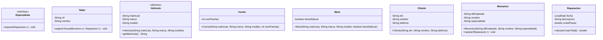

```mermaid
classDiagram
    class Especialista {
        <<interface>>
        +reparar(Reparacion r) void
    }

    class Taller {
        -String cif
        -String nombre
        +asignarTarea(Mecanico m, Reparacion r) void
    }

    class Vehiculo {
        <<abstract>>
        -String matricula
        -String marca
        -String modelo
        +Vehiculo(String matricula, String marca, String modelo)
        +getMatricula() String
    }

    class Coche {
        -int numPuertas
        +Coche(String matricula, String marca, String modelo, int numPuertas)
    }

    class Moto {
        -boolean tieneSidecar
        +Moto(String matricula, String marca, String modelo, boolean tieneSidecar)
    }

    class Cliente {
        -String dni
        -String nombre
        -String telefono
        +Cliente(String dni, String nombre, String telefono)
    }

    class Mecanico {
        -String idEmpleado
        -String nombre
        -String especialidad
        +Mecanico(String idEmpleado, String nombre, String especialidad)
        +reparar(Reparacion r) void
    }

    class Reparacion {
        -LocalDate fecha
        -String descripcion
        -double costePiezas
        +calcularCosteTotal() double
    }
```
