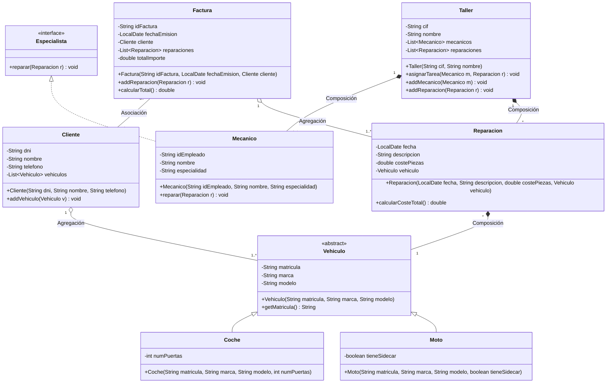

## UML Actualizado (Fase 4: Ingeniería Inversa)

A partir del código implementado en las fases anteriores y de la nueva clase `Factura` creada directamente en el código Java, se ha aplicado ingeniería inversa para generar el siguiente diagrama estructurado:

